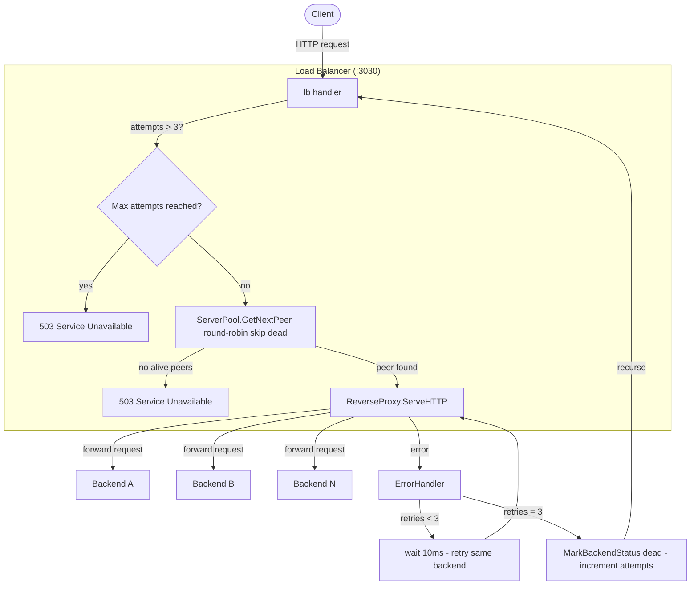
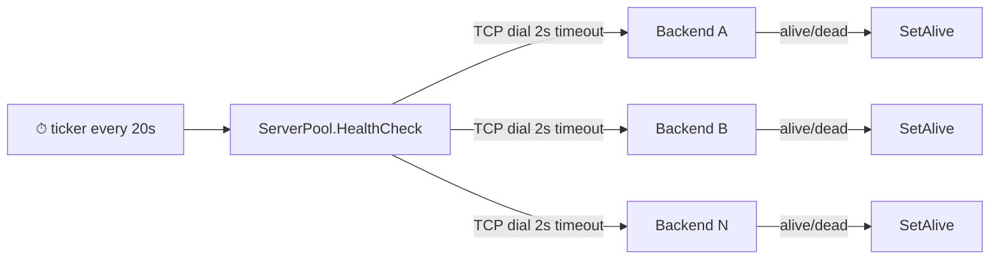
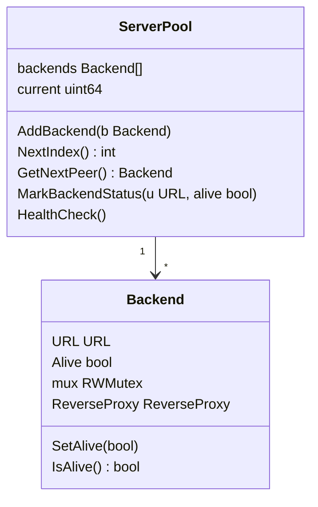

# Load Balancer — How It Works

## Request Flow

```mermaid
flowchart TD
    Client([Client]) -->|HTTP request| Handler

    subgraph LB ["Load Balancer (:3030)"]
        Handler[lb handler] -->|attempts > 3?| MaxCheck{Max attempts reached?}
        MaxCheck -->|yes| R503A[503 Service Unavailable]
        MaxCheck -->|no| Pool[ServerPool.GetNextPeer round-robin skip dead]
        Pool -->|no alive peers| R503B[503 Service Unavailable]
        Pool -->|peer found| Proxy[ReverseProxy.ServeHTTP]
    end

    Proxy -->|forward request| B1[Backend A]
    Proxy -->|forward request| B2[Backend B]
    Proxy -->|forward request| B3[Backend N]

    Proxy -->|error| EH[ErrorHandler]
    EH -->|retries < 3| Retry[wait 10ms - retry same backend]
    Retry --> Proxy
    EH -->|retries = 3| Mark[MarkBackendStatus dead - increment attempts]
    Mark -->|recurse| Handler
```

## Passive Health Check

```mermaid
flowchart LR
    Ticker["⏱ ticker every 20s"] --> HC[ServerPool.HealthCheck]
    HC -->|TCP dial 2s timeout| B1[Backend A]
    HC -->|TCP dial 2s timeout| B2[Backend B]
    HC -->|TCP dial 2s timeout| B3[Backend N]
    B1 -->|alive/dead| Flag1[SetAlive]
    B2 -->|alive/dead| Flag2[SetAlive]
    B3 -->|alive/dead| Flag3[SetAlive]
```

## Data Model

```mermaid
classDiagram
    class ServerPool {
        backends Backend[]
        current uint64
        AddBackend(b Backend)
        NextIndex() int
        GetNextPeer() Backend
        MarkBackendStatus(u URL, alive bool)
        HealthCheck()
    }

    class Backend {
        URL URL
        Alive bool
        mux RWMutex
        ReverseProxy ReverseProxy
        SetAlive(bool)
        IsAlive() bool
    }

    ServerPool "1" --> "*" Backend
```
